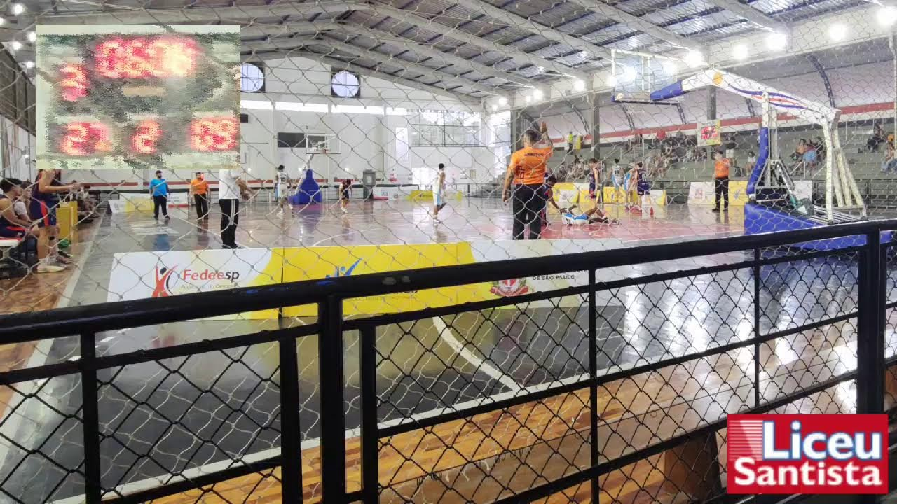

# SportCam em produção — Liceu Santista

Registro feito em 16 de agosto de 2026 durante uma transmissão real.

- Live: [SportCam ao vivo](https://www.youtube.com/watch?v=GqBES2LyeNg)
- Canal: [@eloi.rotava](https://www.youtube.com/@eloi.rotava)
- Estado no momento do registro: ao vivo
- Saída entregue pelo YouTube: 1280 × 720, 30 fps
- Bitrate de vídeo anunciado: aproximadamente 2,19 Mbps

## O que este registro demonstra

Um celular parado e enquadrado antes do jogo conseguiu entregar uma transmissão esportiva acompanhável, sem exigir um operador de câmera dedicado durante a partida. O quadro mostra:

- a quadra inteira coberta pelo grande-angular;
- placar real inserido automaticamente no canto superior esquerdo;
- identidade visual do Liceu Santista aplicada no canto inferior direito;
- imagem estável em uma situação real de ginásio.

O placar ainda pode receber acabamento visual e ocupar menos área da imagem. Isso não muda o principal: o fluxo completo já funcionou fora do ambiente de desenvolvimento e comprovou a proposta do SportCam.

## Próximo passo observado

A configuração remota pelo navegador permitiria deixar o celular definitivamente
posicionado antes do jogo e fazer os ajustes de outro aparelho. A prévia remota
também ajudaria a escolher um enquadramento do placar sem a rede da quadra à
frente, quando houver uma posição física melhor disponível. Esse trabalho está
registrado no [roadmap](../roadmap.md#configuração-remota-pelo-navegador).
